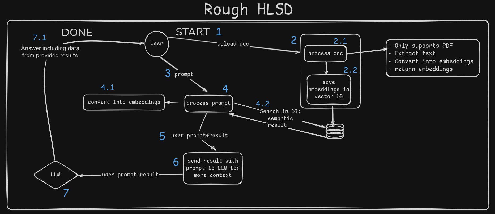

# Q2DOC

Minimal document-QA app with RAG implementation built on top of FastAPI backend and a Vite React frontend.

# High Level System Design
> This was made in planning phase



## Prerequisites
- Python 3.10+
- Node.js 18+
- PostgreSQL with pgvector extension

## How to Run:
```
git clone https://github.com/shivpratapsingh111/q2doc
cd q2doc/app
pip install -r requirements.txt
cd ../../
python3 main.py
```
> NOTE: You can use `files/1.pdf` for testing purposes.

## Backend (FastAPI)
1) Create and activate a virtualenv, then install deps:
```
python -m venv .venv
source .venv/bin/activate
pip install -r app/requirements.txt
```
2) Create a `.env` file (in repo root or `app/`) with at least:
```
DB_USER=youruser
DB_PASSWORD=yourpass
DB_NAME=yourdb
DB_HOST=localhost
DB_PORT=5432
GEMINI_API_KEY=your_gemini_api_key
```
3) Run the API:
```
uvicorn app.api.app:app --host 0.0.0.0 --port 8000
```
API defaults to http://localhost:8000

## Frontend (Vite + React)
1) Configure API base URL in `frontend/.env`:
```
VITE_API_BASE_URL=http://localhost:8000
```
2) Install and run:
```
cd frontend
npm install
npm run dev
```
Dev server runs at http://localhost:5173

## Basic Flow
- Upload a PDF using the paperclip button. The backend stores embeddings per session.
- Ask questions about the uploaded document.

## Key Paths
- Backend entry: `app/api/app.py`
- Upload route: `app/api/upload/routes.py`
- Prompt route: `app/api/prompt/routes.py`
- Frontend entry: `frontend/src/App.jsx`

## TODO
- [ ] Add better file handling, include multiple file support
- [ ] Add http polling
- [ ] Add status column in DB, to know when the processing of document is completed (it takes time).
- [ ] Better Async
- [ ] Fix: No menu button in Mobile [frontend]